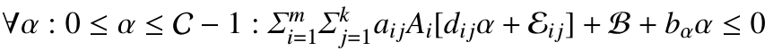

| **Title**     | SMT-Based Array Invariant Generation                                                         |
|:-------------:|----------------------------------------------------------------------------------------------|
| **Authors**   | Daniel Larraz, Enric Rodríguez-Carbonell and Albert Rubio                                    |
| **Venue**     | VMCAI'13                                                                                     |
| **Tool**      | Binary only: [CppInv](www.lsi.upc.edu/~albert/cppinv-bin.tar.gz) contains also array support |
| **Invariant** | Linear, Array                                                                                |

# Summary

The apprach extends [colon_linear_2003.md](colon_linear_2003.md) to generate 
constraints for programs with arrays.
The programs are assumed to consist of unnested loops and linear assignments,
conditions and array accesses and generate invariant of the form:

## Note 
The first author is the author of [larraz_hurtado_automatic_2011.md](larraz_hurtado_automatic_2011.md)

The method uses SMT on quantifier-free non-linear integer arithmetics (QF_NIA) theory.

# Evaluation 
- Generates invariants for a set of twelve single loop programs that manipulate arrays
- Adds a set of 38 student solutions for a binary-search like algorithm.
- No time evaluation
