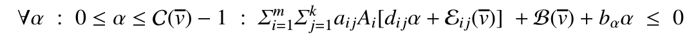

| **Title**     | SMT-Based Array Invariant Generation                                                         |
|:-------------:|----------------------------------------------------------------------------------------------|
| **Authors**   | Daniel Larraz, Enric Rodríguez-Carbonell and Albert Rubio                                    |
| **Venue**     | VMCAI'13                                                                                     |
| **Tool**      | Binary only: [CppInv](www.lsi.upc.edu/~albert/cppinv-bin.tar.gz) contains also array support |
| **Invariant** | Linear, Array                                                                                |

# Summary

The apprach extends [colon_linear_2003.md](colon_linear_2003.md) to generate 
constraints for array non-nested loops in the form:

